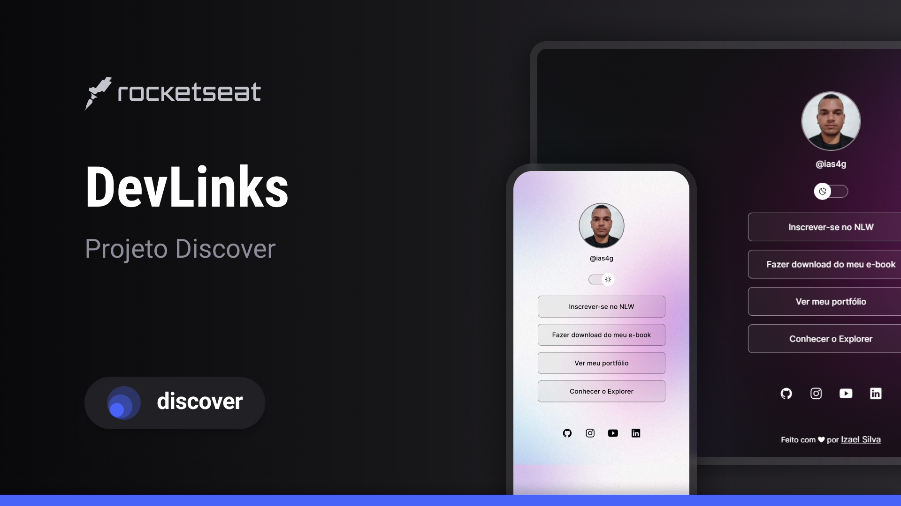

  # DevLinks
  <!-- <a href="#tecnologias">Tecnologias</a> |
  <a href="">Projeto</a> |
  <a href="">Layout</a> |
  <a href="#licença">Licença</a> |  -->

  [Tecnologias](#-tecnologias) | [Projeto](#-projeto) | [Layout](#-layout) | [Licença](#-licença)

  DevLinks é um agregador de links responsivo e com troca de tema que você pode usar como cartão de visitas nas suas redes sociais.
  
  Esse projeto é desenvolvido com HTML, CSS e JavaScript no [Discover](https://www.rocketseat.com.br/discover?utm_source=figma&utm_medium=organic&utm_campaign=lead&utm_term=discover&utm_content=description_figma-lp_discover)🔗, o programa 100% gratuito da [Rocketseat](https://www.rocketseat.com.br)🔗 para aprender programação do zero e na prática.

## 🚀 Tecnologias
  * Html5 & Css3
  * JavaScript
  * Git & GitHub

## 💻 Projeto
O devLinks é uma ótima ferramenta para desenvolvedores que querem compartilhar suas informações de forma mais profissional. É uma forma fácil de mostrar seu trabalho e se conectar com outros profissionais da área. Um desenvolvedor pode usar o devLinks para compartilhar seu portfólio, projetos, redes sociais e contatos. Qualquer pessoa pode usar o devLinks para compartilhar seus links de interesse, como sites, blogs, vídeos e cursos.

Para ver o projeto hospedado [clique aqui](https://dev-links-by-ias4g.netlify.app/)🔗.

## 📝 Layout
Você pode visualizar o layout do projeto [neste link](https://www.figma.com/file/YxESHmbJjZpaNDcRqBvMJF/DevLinks-%E2%80%A2-Projeto-Discover-(Community)-(Copy)?type=design&node-id=10%3A620&mode=design&t=V29yuydlOTM8DjrD-1). è necessário ter uma conta no [Figma](https://www.figma.com) para acessá-lo.

## © Licença
Este projeto está sob a licença [MIT](./LICENSE).

 
 
 
 

Feito com 💖 by Izael Silva (ias4g).
